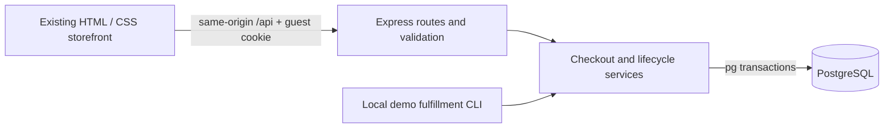
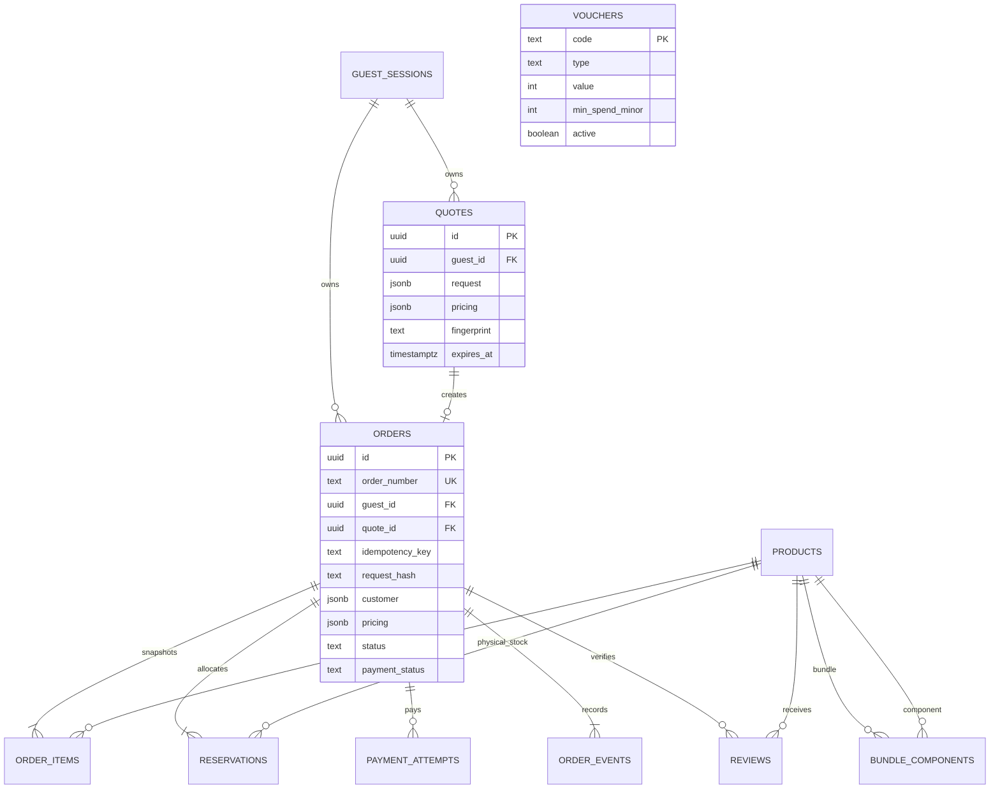

# Architecture and data model

Vouchers are copied into pricing snapshots rather than linked by a mutable foreign key. `rate_limits` holds temporary shared request counters; `schema_migrations` records installed SQL versions. Product presentation details are JSONB; product identity, price, stock, and component relationships are relational columns.

## Inventory invariant

`products.stock` is currently available physical stock, not total stock before reservations. Bundle stock is derived from component availability. Bundles have no independent pool of physical units.

Order creation locks affected product rows in sorted slug order, validates combined component quantities, inserts immutable item/pricing snapshots, decrements stock, and inserts reservations in the same transaction. Any error rolls back all of these changes.

Prepaid reservations start `held`; COD reservations start `committed`. Successful payment changes held to committed without decrementing stock again. Cancellation/expiration increments stock only for reservations not already `released`, then marks them released under the order lock. This prevents double restoration.

Lifecycle operations lock the order before its product rows. The expiration sweep reconciles individual due orders in separate short transactions. This avoids background timers and works across Vercel instances. There is no scheduled worker dependency: relevant catalog, quote, order, and payment requests reconcile due reservations using database time. An idle deployment may retain an unreconciled row until the next request, which is reconciled before inventory is used.

## State transitions

| Trigger | Order status | Payment status | Stock |
|---|---|---|---|
| Prepaid order accepted | To Pay | Unpaid | Decrement; held for 15 minutes |
| COD order accepted | To Ship | Pending COD | Decrement; committed |
| Simulation succeeds | To Ship | Paid | Held → committed; no additional decrement |
| Attempt declined/cancelled | To Pay | Unpaid | Held until original deadline |
| Reservation expires | Expired | Unpaid | Release once |
| Cancel before shipment | Cancelled | Unpaid / Pending COD / Refunded | Release once |
| Demo CLI ships | Shipped | Unchanged | Committed |
| Demo CLI completes | Completed | Paid | Committed; COD collection simulated |

Only the local demo CLI advances shipping and delivery. No public admin/fulfillment endpoint exists. Each successful transition appends an event in the same transaction. Tracking reads these events; it never invents a future courier checkpoint.

Guest sessions are database-backed with random 256-bit bearer cookies stored only as hashes server-side. Order identifiers are random references, not credentials. Sessions expire after 30 days and cannot be recovered across browsers in this version.

## Source boundaries

- `server/app.js`: HTTP routes, session/origin checks, shared rate limiter, error responses.
- `server/commerce.js`: pricing, inventory transactions, payments, order lifecycle, and reviews.
- `server/db.js`, migrations, and seed: PostgreSQL access and repeatable catalog initialization.
- `js/api.js`: HTTP client and guest-session initialization.
- Root HTML and `js/`: canonical frontend; `public/` is generated from an allowlist.
- `server/squishies-db.json`: preserved legacy data, never served or read by the new backend.

The integration retains existing component classes and design tokens. Small CSS additions handle mobile receipt wrapping, readable event history, disabled controls, and the new review textarea.

## Intentionally limited

This project demonstrates reliable commerce rules; it does not implement real payment settlement, courier APIs, email delivery, customer accounts, an admin dashboard, tax accounting, or production dispute/refund handling. No claim of enterprise certification or production payment readiness is made.
